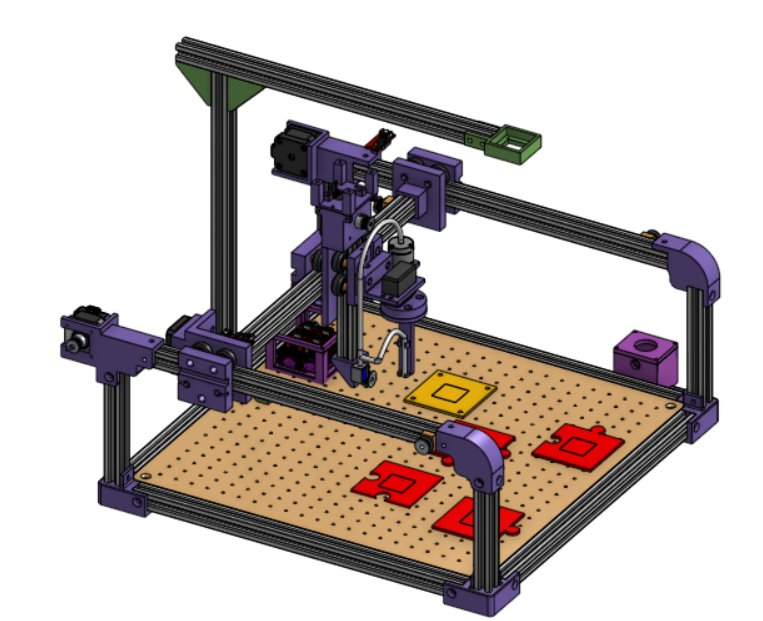

# Étude et choix techniques

Cette partie présente les différentes solutions techniques étudiées au cours du projet ainsi que les critères qui ont conduit à nos choix. Chaque décision a été prise en tenant compte des contraintes mécaniques, de la facilité de réalisation, du coût, de la précision attendue et de l’évolutivité de la machine.

  