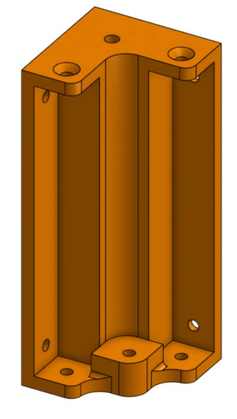
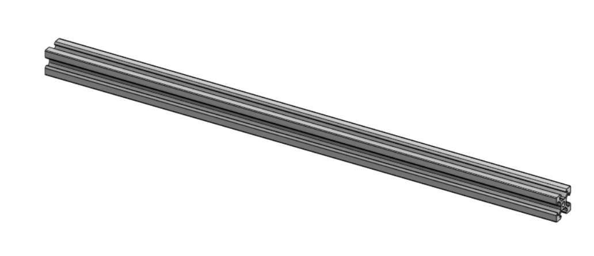

# Choix de la structure : profils aluminium ou pièces imprimées en PLA

Lors de la conception de la structure, deux solutions ont été étudiées :

## Solution 1 : pièces imprimées en PLA

Le PLA (polylactic acid) permet de réaliser rapidement des pièces personnalisées grâce à l’impression 3D.

**Avantages :**
* Bonne stabilité pour les petites pièces ; 
* Réduction du nombre de vis et d’éléments d’assemblage ; 
* Fabrication de formes complexes facilement. 

**Inconvénients :**
* Temps d’impression parfois important ; 
* Modifications limitées une fois la pièce réalisée ; 
* Résistance mécanique inférieure à celle d’une structure métallique ; 

Sensibilité à la température et à l’usure. 

## Solution 2 : profils aluminium

Les profils aluminium offrent une structure modulaire largement utilisée dans les machines industrielles et les imprimantes 3D.

**Avantages :**
* Grande rigidité mécanique ; 
* Modifications et ajustements rapides ; 
* Facilité d’extension de la machine ; 

Dimensions modifiables sans refaire l’ensemble de la structure. 

**Inconvénients :**
* Utilisation d’un nombre plus important de vis et d’éléments de fixation ; 
* Assemblage plus long. 

### Choix retenu
Nous avons finalement retenu les profils aluminium pour la structure principale de la machine. Malgré un assemblage plus complexe, cette solution offre une meilleure rigidité, une plus grande modularité et permet d'effectuer facilement des modifications au cours du développement.