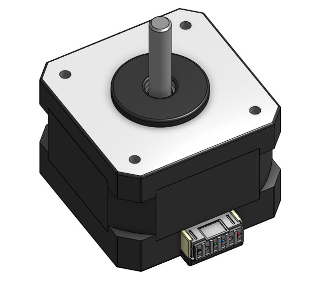
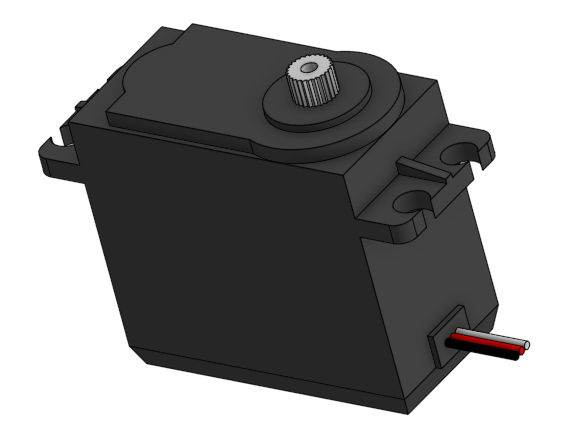

# Choix de la motorisation

Afin de garantir la précision et la fiabilité des déplacements, la machine est équipée de cinq moteurs répartis sur les différents axes.

## Double motorisation de l’axe X

L’axe X est constitué de deux profilés aluminium parallèles. Afin d’éviter tout risque de désalignement ou de blocage mécanique, nous avons choisi d'utiliser deux moteurs pas-à-pas synchronisés, un de chaque côté de la structure.

Cette solution permet :
* d'assurer un déplacement parfaitement parallèle ; 
* de réduire les efforts mécaniques sur la structure ; 
* d'éviter les phénomènes de torsion ou de point dur. 

## Motorisation de l’axe Y

L’axe Y est entraîné par un unique moteur pas-à-pas.

Ce moteur assure le déplacement du chariot principal supportant :
* l’axe Z ; 
* l’axe de rotation ; 
* le système de préhension. 

Le couple disponible est suffisant pour déplacer l’ensemble de ces éléments tout en conservant une bonne précision.

## Motorisation de l’axe Z

L’axe Z réalise les mouvements verticaux de prise et de dépose des pièces.

Plusieurs solutions ont été envisagées, notamment l’utilisation d’un servomoteur. Cependant, le poids supporté par cet axe est relativement important puisqu’il doit déplacer :
* son propre chariot ; 
* le système de préhension ; 
* le servomoteur de rotation. 

Nous avons donc choisi un moteur pas-à-pas, capable de fournir un couple plus élevé et de maintenir précisément la position de l’axe pendant les opérations de manutention.

## Servomoteur pour l’axe de rotation

L’axe de rotation (axe R) permet d’orienter les pièces avant leur déplacement ou leur dépôt.

Pour cette fonction, nous avons retenu un servomoteur, installé horizontalement sur l’axe Z. Ce choix permet :
un contrôle précis de l’angle de rotation ; 
une mise en position rapide ; 
une intégration mécanique simple sur le chariot vertical. 
Cette solution est particulièrement adaptée aux mouvements de rotation nécessitant un positionnement angulaire précis.

|  |  |
| :---: | :---: |
| **Moteur pas à pas** | **Servo moteur** |
