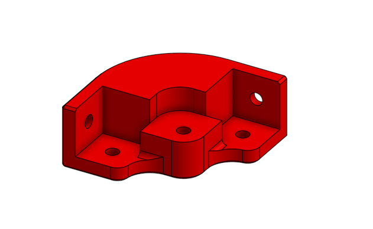
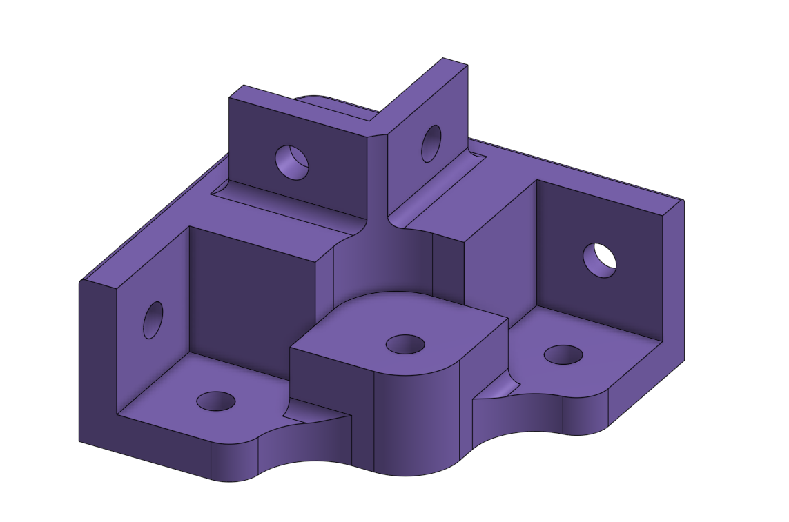
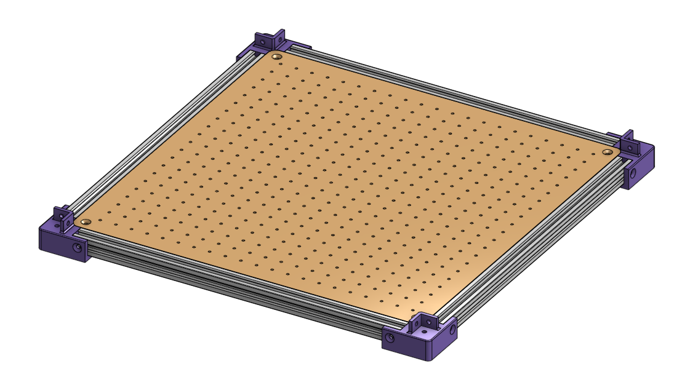

# Conception du Plateau inférieur

## 1. Matériel initiale
Au début du projet, la structure de base du plateau était composée de :

* Un panneau de bois central.

* Un cadre en profilés d'aluminium entourant le panneau pour assurer la rigidité.

* Quatre coins imprimés en 3D , dont le rôle unique était de lier et de maintenir l'équerrage des profilés d'aluminium horizontaux.

Limitation : Cette configuration initiale ne permettait pas de prolonger la structure vers le haut. Pour faire évoluer la machine, il manquait des points d'ancrage verticaux solidement liés au châssis bas.

## 2. Évolution de la conception
Pour répondre au besoin d'élever la structure, les pièces d'angle ont été entièrement reconçues .

 Cette nouvelle version intègre une double fonction :

* Fonction d'assemblage horizontal : Elle conserve le maintien du cadre en profilés d'aluminium du plateau bas.

* Fonction de guidage et fixation verticale : L'ajout d'un montant en équerre sur la partie supérieure permet de venir y glisser et visser des profilés en hauteur.

|  |  |
| :---: | :---: |
| **Avant** | **Après** |

## 3. Résultat sur l'assemblage global
Grâce à cette modification, les nouveaux coins violets permettent de lier rigidement le plateau inférieur aux montants verticaux de la machine, assurant ainsi une meilleure stabilité globale de la structure sans ajouter de pièces de fixation supplémentaires (gain de place et optimisation du nombre de composants).

