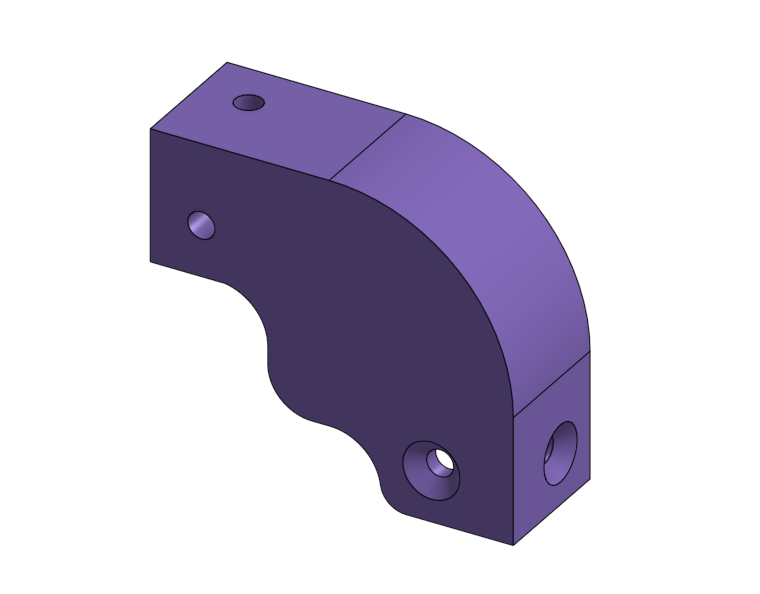
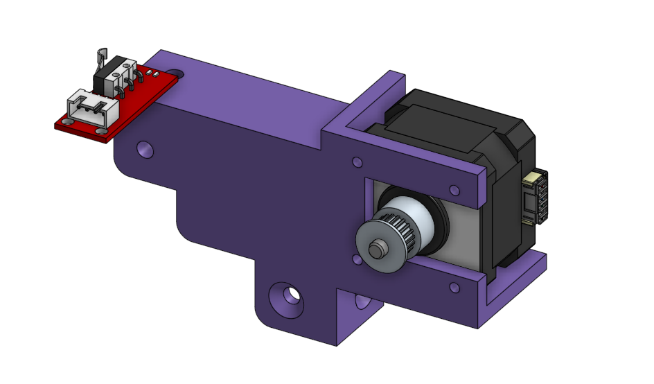
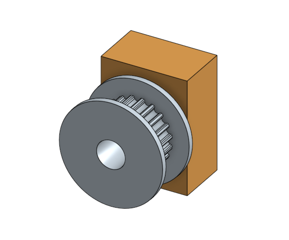
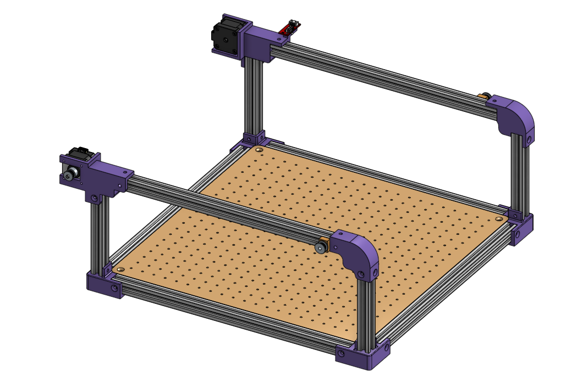

# Conception de l'Axe X 

## 1. Configuration de base de la structure haute

Une fois le plateau inférieur validé et les montants verticaux installés, l'objectif est de fermer le châssis supérieur pour accueillir l'axe Y. Cette structure haute se compose de :

Deux profilés d'aluminium horizontaux parallèles (faisant office de rails de guidage pour l'axe Y).

Quatre nouveaux coins imprimés en 3D assurant la liaison avec les montants verticaux.

Contrainte de conception : Contrairement au plateau inférieur où les quatre coins étaient identiques, l'axe X impose de distribuer des fonctions mécaniques différentes (motorisation, tension, détection) sur chaque angle de la structure.

## 2. Spécification des pièces d'angle 

Pour répondre aux besoins de mouvements de la machine, deux versions de coins supérieurs ont été conçues :

* Version de renvoi / passive : * Fonction d'assemblage : Assure la liaison rigide entre le montant vertical et le profilé horizontal.

    * Fonction de tension : Intègre à son extrémité un support en laiton et une poulie crantée pour guider et maintenir la tension de la courroie.

* Version motorisée / active : * Fonction d'entraînement : Reçoit le moteur pas-à-pas chargé de mouvoir l'axe mécanique.

    *Fonction de sécurité / calibration : Supporte un capteur de fin de course (micro-interrupteur) pour permettre la prise de référence (Homing) de la machine.

||||
| **Sans Moteur** | **Avec Moteur et Capteur** | **Support de fin de courroie** |
| :---: | :---: | :---: |

## 3. Résultat sur l'assemblage global
L'intégration directe des supports moteurs, des poulies de renvoi et des capteurs de fin de course au sein même des pièces d'angle (les coins violets) permet d'épurer la structure haute. On évite ainsi l'ajout de supports dédiés superflus, ce qui optimise le volume utile de la machine et simplifie grandement l'assemblage final.
