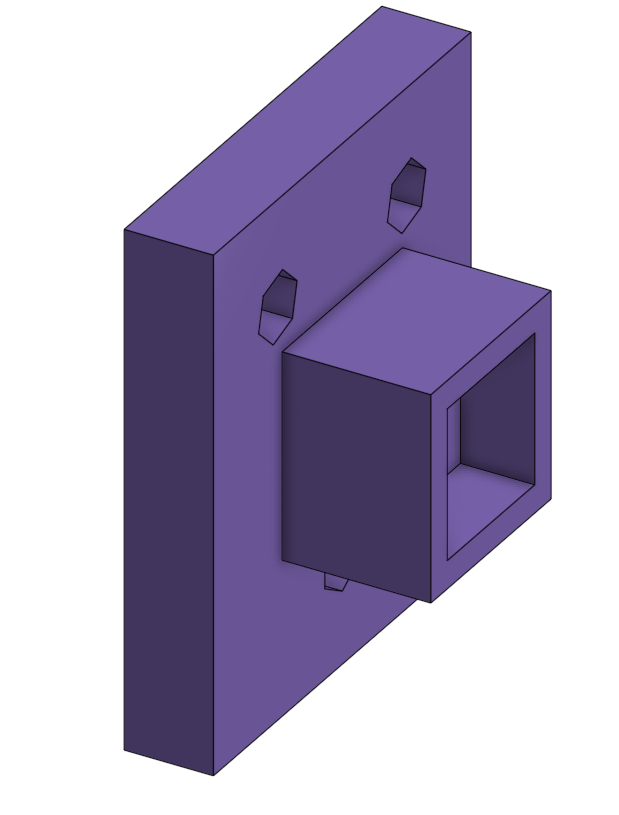
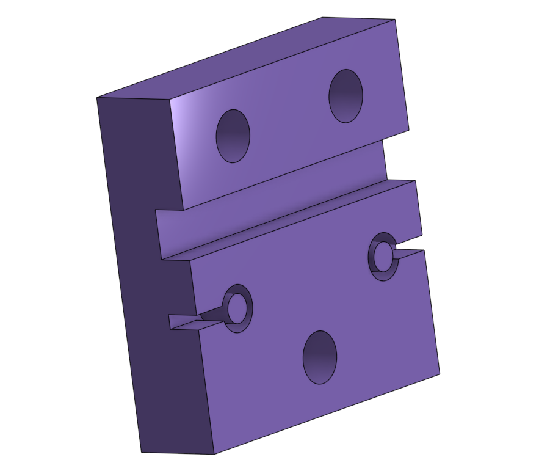
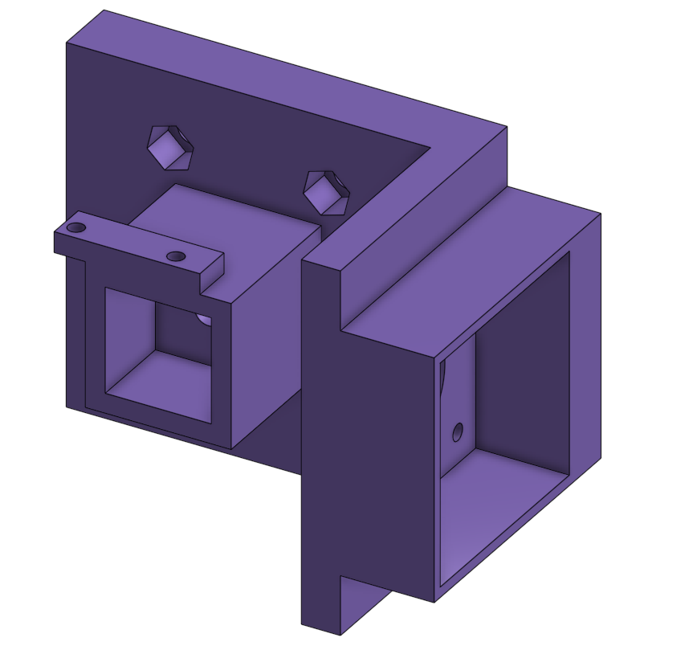
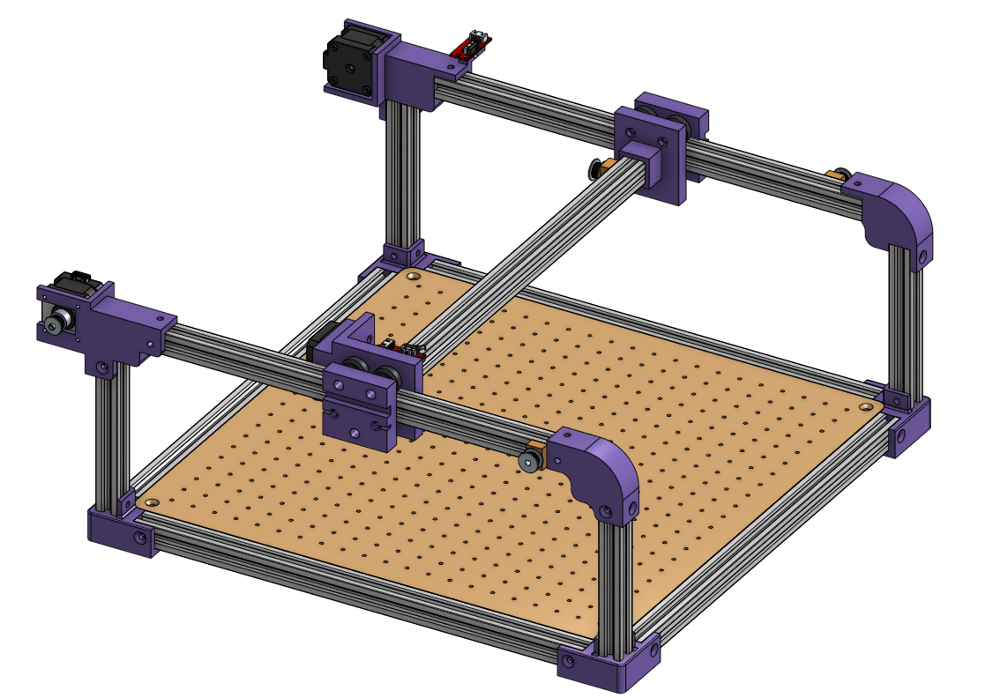

# Conception de l'Axe Y 

## 1. Configuration de base de l'axe Y

L'axe Y repose directement sur la structure supérieure de l'axe X. Le mouvement de translation est assuré par deux chariots latéraux reliés entre eux par un profilé d'aluminium transversal. Chaque chariot type est composé de :

Un système de guidage à 3 roues : Des roues spécifiques pour profilés qui viennent se pincer sur les rails en aluminium pour assurer un déplacement fluide.

Des entretoises et rondelles : Six rondelles/intercalaires permettent de gérer l'écartement des roues de guidage mécaniques.

Un système d'ancrage extérieur : Une encoche ou pièce dédiée permettant de prendre et de fixer la courroie de l'axe X pour entraîner l'ensemble.

| [AxeY7](../images/Conception/AxeY7.png) | [AxeY5](../images/Conception/AxeY5.png) | [AxeY4](../images/Conception/AxeY4.png) |
| :---: | :---: | :---: |
| **Roues** | **Rondelle** | **Ancrage extérieur** |

Contrainte de conception : Pour l'assemblage intérieur qui maintient le profilé transversal, les deux chariots latéraux ne sont pas identiques. L'un doit supporter la motorisation propre à l'axe Y.

## 2. Spécification des chariots 

Pour répondre à cette contrainte, deux versions de chariots imprimés en 3D ont été conçues :

* Le chariot passif  : * Fonction de guidage et liaison : Il intègre les trous pour le bloc de 3 roues et la gorge pour emboîter et fixer solidement le profilé d'aluminium transversal reliant les deux côtés.

|  |  |
| :---: | :---: |
| **Chariot Intéreur** | **Chariot Extérieur** |

* Le chariot actif / motorisé (AxeY2.png et AxeY6.png) : * Fonction de liaison : Il maintient également le profilé transversal de l'axe Y.

    *Fonction de motorisation et détection : L'ajout d'une platine et d'un logement spécifique permet d'accueillir le moteur pas-à-pas de l'axe Y ainsi que son capteur de fin de course pour stopper la course en toute sécurité.

    |  |  |
    | :---: | :---: |
    | **Chariot Intéreur** | **Chariot Extérieur** |

[AxeY6](../images/Conception/AxeY6.png)

## 3. Résultat sur l'assemblage global

Cette conception en vis-à-vis permet de créer un pont roulant rigide et parfaitement synchronisé. En intégrant directement le support moteur, le capteur et la fixation du profilé sur une seule pièce imprimée (AxeY6.png), l'encombrement est minimal et l'alignement des roues de guidage sur les profilés de l'axe X reste optimal tout au long du déplacement.
