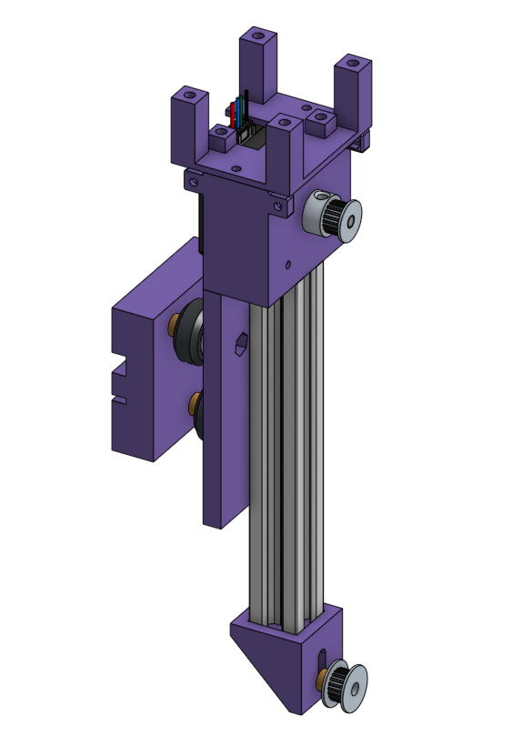
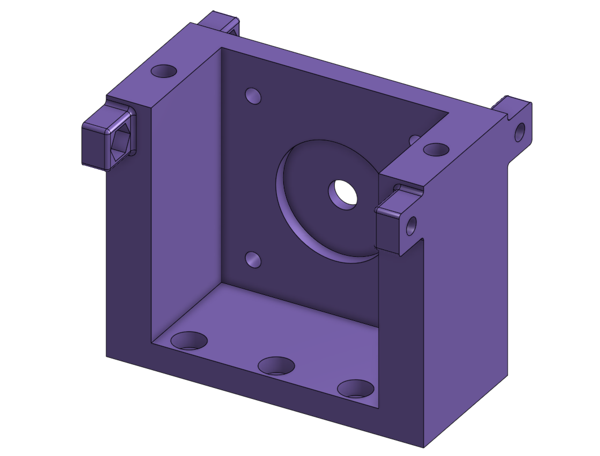
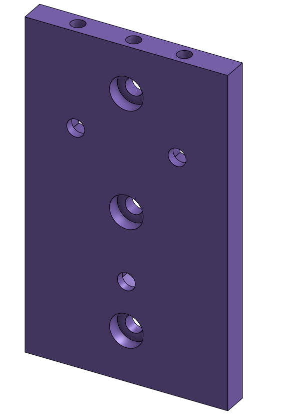
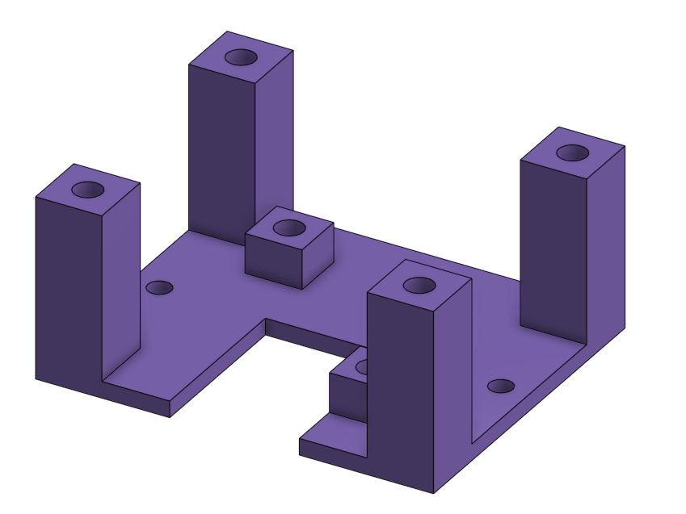
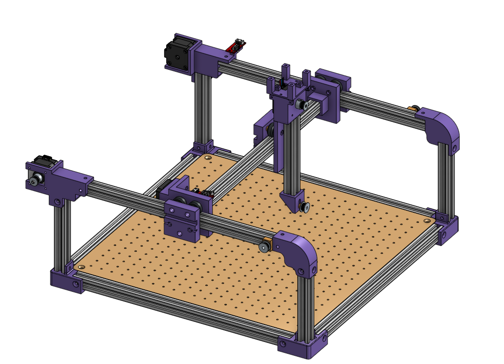

# Conception de l'Axe Z

## 1. Configuration de base de l'axe Z

L'axe Z est conçu pour supporter et guider le déplacement vertical du bloc outil. Sa structure mécanique repose sur un chariot mobile principal et intègre les éléments suivants :

* Un système d'ancrage de courroie : D'un côté, le chariot conserve la même géométrie extérieure éprouvée sur les autres axes afin de venir pincer fermement la courroie de transmission pour le mouvement vertical.

* Un profilé vertical fixe : Le chariot principal supporte et bride un profilé d'aluminium vertical. Ce profilé ne bouge pas par rapport au chariot ; il fait office de colonne de guidage fixe sur laquelle viendra coulisser le prochain chariot dédié au mécanisme de rotation.

* Une pièce de fin de profilé : Un composant spécifique est installé à l'extrémité supérieure pour fermer le profilé, rigidifier l'ensemble et permettre, si nécessaire, la fixation d'un autre profilé structurel.

|  |  |
| :---: | :---: |
| **Ancrage de courroie** | **Fin de profilé** |

Contrainte de conception : Pour des raisons de modularité, de facilité d'impression 3D et de maintenance, la plaque principale du chariot opposé a été divisée en trois composants distincts assemblés ensemble, formant un unique bloc fonctionnel compact.

## 2. Spécification de la pièce maîtresse 

Pour éviter de concevoir un bloc monobloc massif et complexe, l'ensemble a été segmenté en un sous-assemblage de trois pièces imprimées en 3D et vissées entre elles :

* Le module Chariot : Il assure la liaison glissière sur les axes horizontaux et sert de base structurelle rigide pour maintenir le profilé d'aluminium vertical de guidage.

* Le module Support Moteur : Fixé directement sur le module chariot, il est conçu spécifiquement pour accueillir et brider le moteur pas-à-pas de cet axe.

* Le module Électronique : Une extension dédiée à la fixation et à la protection de la carte électronique de commande de la pompe.

|  |  |  |
| :---: | :---: | :---: |
| **module Support Moteur** | **Module Chariot** | **Module Électronique** |

## 3. Résultat sur l'assemblage global

Cette conception modulaire en trois pièces solidaires offre un excellent compromis technique. Elle permet d'imprimer beaucoup plus facilement les composants en 3D (en évitant des formes complexes nécessitant trop de supports d'impression) tout en offrant la possibilité de démonter ou de modifier uniquement la partie moteur ou la partie électronique lors de la maintenance. L'intégration finale regroupe proprement toute l'intelligence et le guidage vertical de l'axe Z sur un seul bloc mobile.

