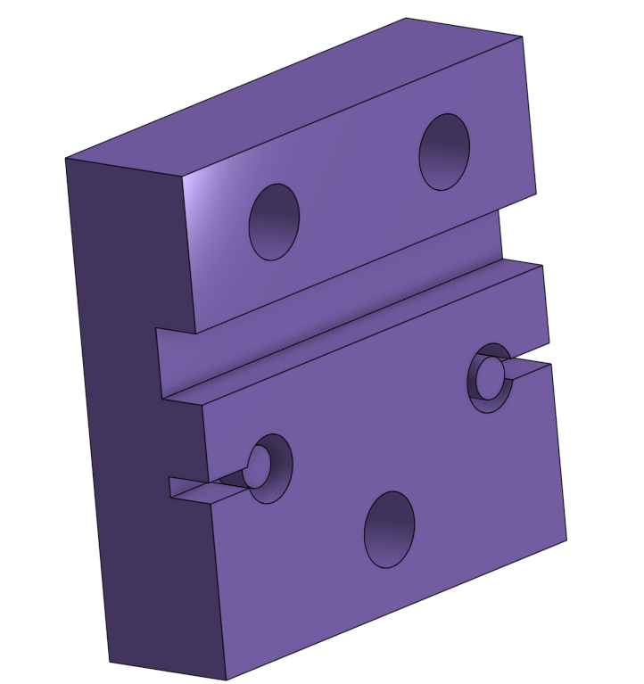
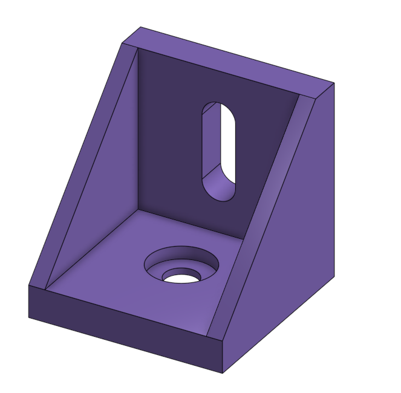
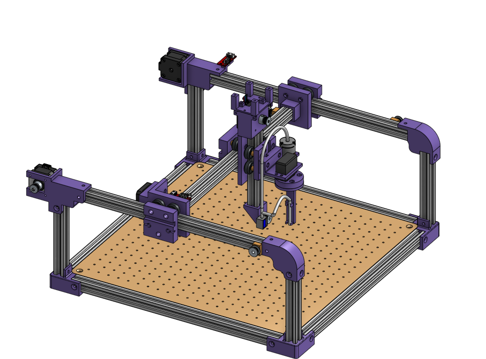

# Conception de l'Axe R 

## 1. Le chariot de l'axe Z

Pour assurer le déplacement vertical et la liaison avec la suite du système, l'axe R est basé sur un chariot spécifique monté sur le profilé d'aluminium de l'axe Z :

* Un système de guidage renforcé : Ce chariot est équipé de quatre roues (au lieu de trois sur les axes précédents) afin de garantir une stabilité mécanique maximale lors des mouvements de montée et de descente.

* L'ajustement mécanique : Quatre rondelles/entretoises sont intercalées au niveau des axes des roues pour assurer l'écartement parfait et un serrage optimal sur le profilé.

## 2. La pièce de support du moteur et de la pompe

Directement reliée et boulonnée sur le chariot fixe, une toute nouvelle pièce support a été conçue pour centraliser la puissance de l'effecteur final :

* Double fonction de support : Cette pièce intermédiaire unique accueille en simultané le servomoteur électrique et la pompe pneumatique qui alimente la ventouse. Elle permet de compacter l'ensemble des actionneurs sur un seul bloc rigide.

## 3. Le mécanisme de rotation

Pour réaliser la fonction de rotation de l'outil, le mécanisme a été divisé en deux pièces distinctes montées en cascade :

* La pièce d'accouplement : Fixée directement sur l'arbre du servomoteur, son rôle est de transmettre le couple mécanique du moteur et de servir d'interface de fixation robuste pour l'élément suivant.

* La pièce de guidage pneumatique : Installée par-dessus la première, cette pièce spécifique est conçue pour maintenir fermement le tuyau de la pompe à vide, assurant ainsi que le flux d'air reste parfaitement aligné sans pincer ou emmêler le tube lors de la rotation.

|  |  |
| :---: | :---: |
| **Ancrage de courroie** | **Fin de profilé** |

## 4. Résultat sur l'assemblage global

L'utilisation d'un chariot à quatre roues apporte une rigidité essentielle pour contrer l'effet de levier du bloc outil. En séparant le mécanisme de rotation en deux composants distincts, l'assemblage gagne en modularité. Ce choix de conception permet d'aligner parfaitement l'axe du servomoteur avec le guidage du tuyau pneumatique, garantissant une rotation fluide, précise et sans contrainte sur la ventouse lors de la saisie des pièces.

