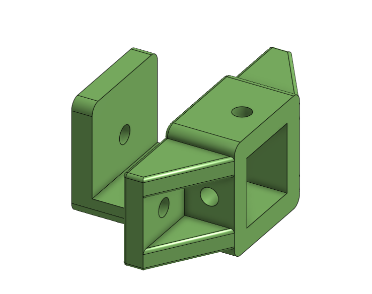
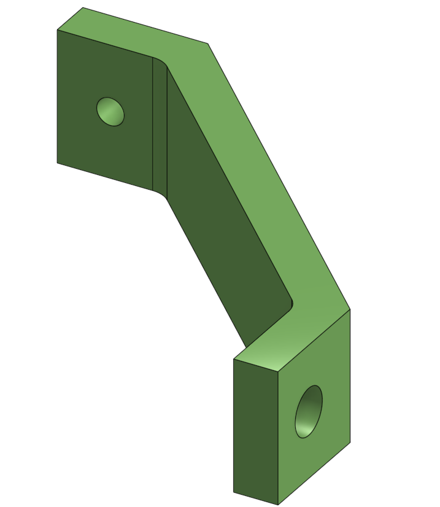
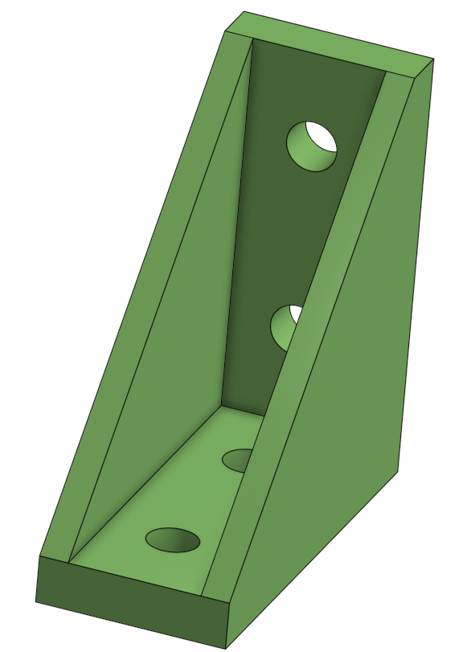
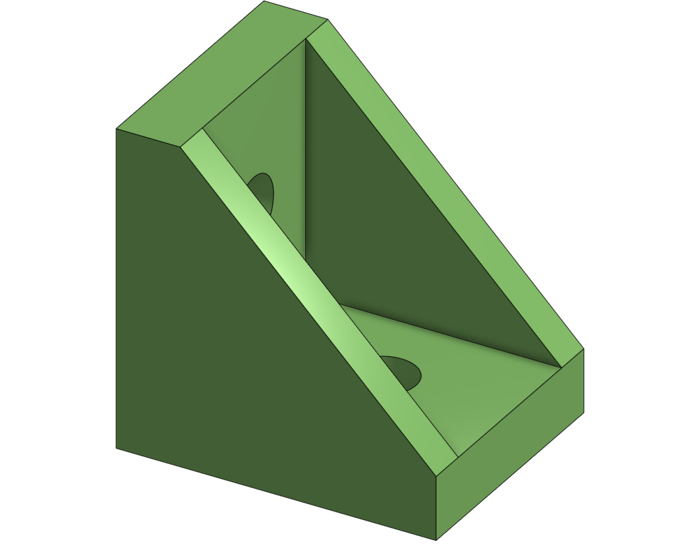
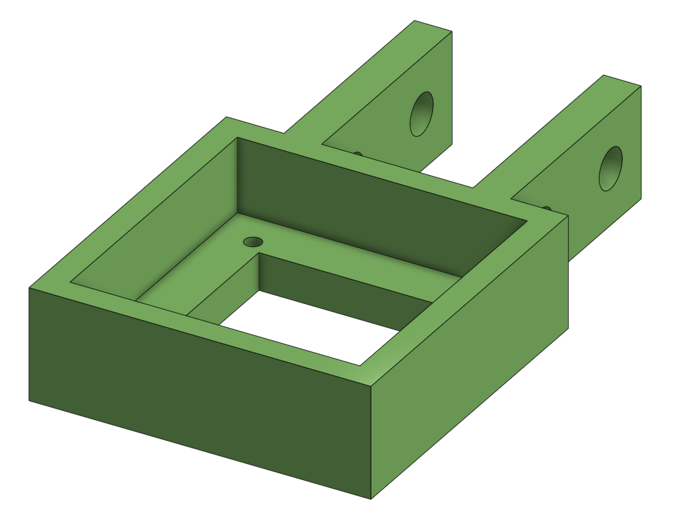
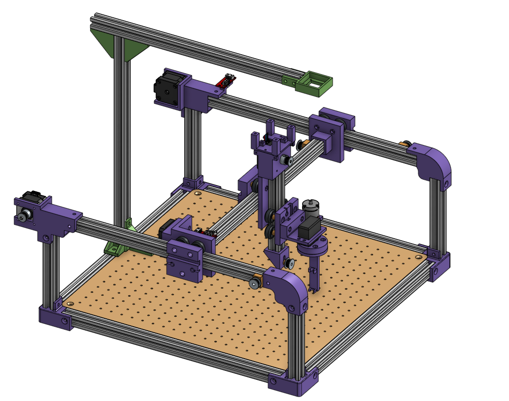

# Conception du Support Caméra

## 1. Configuration des supports inférieurs 
Pour assurer l'ancrage de la structure de la caméra à la base de la machine, deux types de supports inférieurs fixes ont été développés afin de s'adapter à l'environnement du plateau :

* Le support sur profilé : Un premier pied vient se glisser et se fixer directement dans la rainure du profilé d'aluminium entourant le plateau.

* Le support en jambe de force : À l'opposé, pour des raisons d'encombrement ou de rigidité, le second pied est conçu sous forme de jambe de force venant se visser directement sur le panneau en bois du plateau central.

|  |  |
| :---: | :---: |
| **Support sur profilé** | **Jambe de force** |

## 2. Spécification des supports supérieurs 
La liaison haute qui ferme le portique de la caméra utilise deux supports imprimés en 3D de tailles différentes pour créer le déport nécessaire :

* Le grand support supérieur : Placé d'un côté pour surélever la structure et déporter la ligne de visée.

* Le petit support supérieur : Positionné de l'autre côté pour fermer l'équerrage du cadre haut de manière compacte.

|  |  |
| :---: | :---: |
| **Grand support supérieur** | **Petit support supérieur** |

## 3. Spécification du support de la caméra
La caméra est installée au centre de cette structure dédiée (Camera2.png). Son intégration se fait en deux étapes simples et robustes :

* Liaison châssis / support : La platine de fixation imprimée en 3D vient s'ancrer solidement sur le profilé d'aluminium haut de la machine à l'aide de vis et d'écrous en T.

* Liaison support / caméra : Le boîtier de la caméra vient ensuite se visser directement sur cette pièce intermédiaire.

## 4. Résultat sur l'assemblage global
Cette conception en portique rigide isole complètement la caméra des vibrations directes des axes X et Y, garantissant ainsi une capture d'image stable et un alignement constant tout au long des opérations de la machine. L'utilisation de supports asymétriques hauts et bas permet d'obtenir un champ de vision optimal sur toute la zone de travail du plateau tout en maximisant la rigidité de la structure d'observation.

