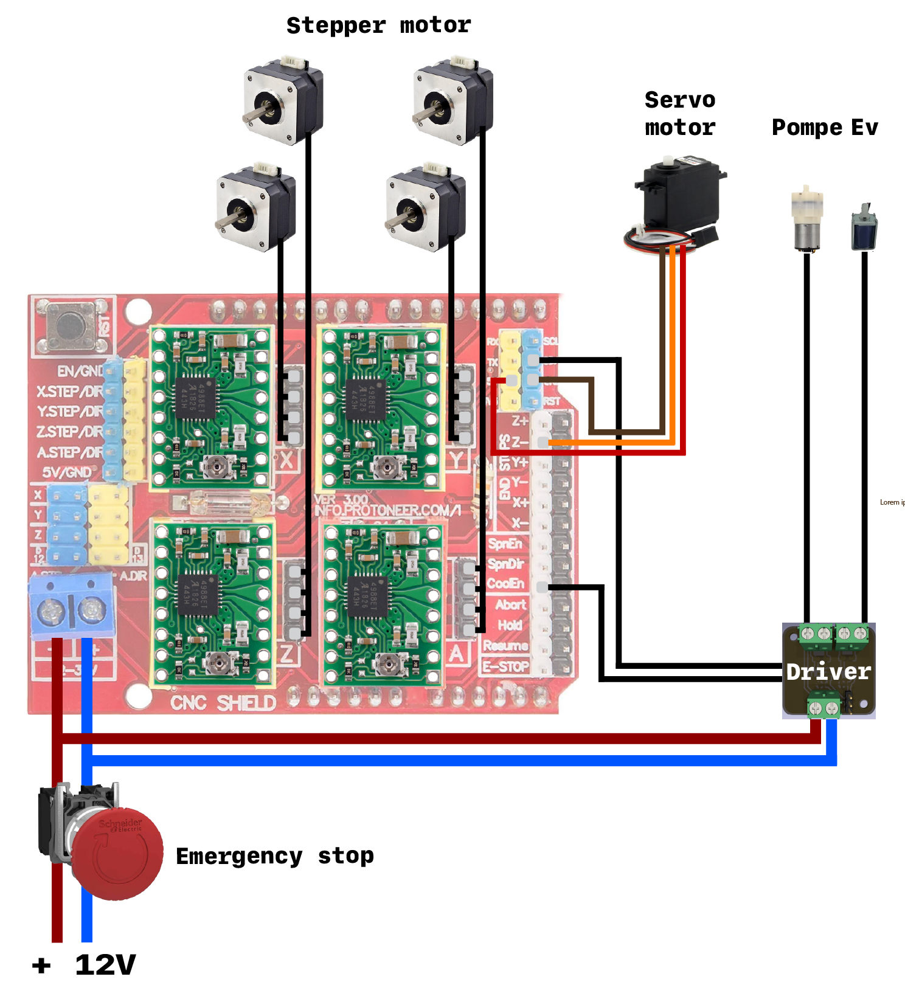

# Partie électronique

Cette section décrit la composition matérielle du robot et la nature des signaux électriques permettant de donner vie aux commandes numériques.

 

1. Choix du matériel

    * Unité de contrôle (microcontrôleur) : Une carte Arduino Uno sert de cerveau de contrôle. Elle exécute le firmware GRBL. Son rôle est de traduire les chaînes de caractères G-code reçues via le port USB en impulsions électriques.
    * CNC Shield V3 : Ce shield est branché directement sur l’Arduino. Il centralise les connexions, distribue l’alimentation générale et accueille les pilotes de moteurs.
    * Pilotes de moteurs (drivers A4988 ou DRV8825) : Ils reçoivent les signaux logiques faibles de l’Arduino (direction et impulsions) et fournissent la puissance nécessaire aux bobines des moteurs pas à pas, tout en limitant le courant pour éviter la surchauffe.
    * Alimentation externe : Elle fournit l’énergie nécessaire aux moteurs pas à pas via le CNC Shield.
 

2. Gestion des actionneurs

Le robot utilise deux types de motorisation radicalement différents, ce qui a nécessité une adaptation des branchements :

* Axes linéaires (X, Y, Z) – moteurs pas à pas (NEMA 17) :
    * Principe : Ces moteurs divisent une rotation complète en un grand nombre de pas (généralement 200 pas par tour, soit 1,8° par pas).
    * Commande : Le CNC Shield leur envoie deux signaux numériques : STEP (une impulsion électrique = un pas) et DIR (0 ou 5 V pour définir le sens de rotation horaire ou antihoraire).
* Axe de rotation de la tête – servomoteur :
    * Principe : Le servomoteur intègre son propre capteur de position.
    * Branchement et commande : Il est connecté au CNC Shield. Il est piloté par un signal à modulation de largeur d’impulsion (PWM – Pulse Width Modulation). La carte génère un signal carré à fréquence fixe, et la durée de l’impulsion détermine l’angle de positionnement du servomoteur.
 

3. Actionneurs auxiliaires

    * Pompe :
        * Rôle : Pour assurer les déplacements, la solution adoptée est l’utilisation de l’aspiration continue des pièces durant le transport via une ventouse.
        * Remarque : Lors de nos tests, nous avons constaté la présence d’un vide dans le système pneumatique, ce qui permet de maintenir les pièces du puzzle accrochées.
    * Électrovanne :
        * Rôle : Il s’agit d’un dispositif électromécanique permettant de contrôler le passage de l’air dans le circuit pneumatique grâce à une bobine commandée électriquement.
        * L’électrovanne intervient lors de la phase de relâchement de la pièce. Elle permet ainsi de résoudre le problème rencontré lors des essais à blanc réalisés précédemment sur la pompe.
 

4. Difficultés électroniques et solutions

    * Problème :
        * Intégration du kit préhenseur dans le système : Dans la majorité des cas, le kit préhenseur est utilisé avec une carte L9110, un circuit intégré de commande de moteurs permettant de piloter de petits moteurs à courant continu. Cependant, nous nous sommes rendu compte que les tensions de sortie de cette carte n’étaient pas suffisantes pour alimenter correctement l’électrovanne. Par conséquent, il n’était pas possible de centraliser l’ensemble des actionneurs sur une même carte de commande. Nous avons donc dû envisager une solution de commande distincte pour l’électrovanne.
        * Carte Arduino : Les signaux de commande générés par le système informatique n’étaient pas correctement exécutés par les actionneurs.
    * Solution :
        * Création d’un driver pour le kit préhenseur : Nous avons dû dimensionner un driver afin de satisfaire les tensions d’alimentation de la pompe et de l’électrovanne. Voir la partie pompe.