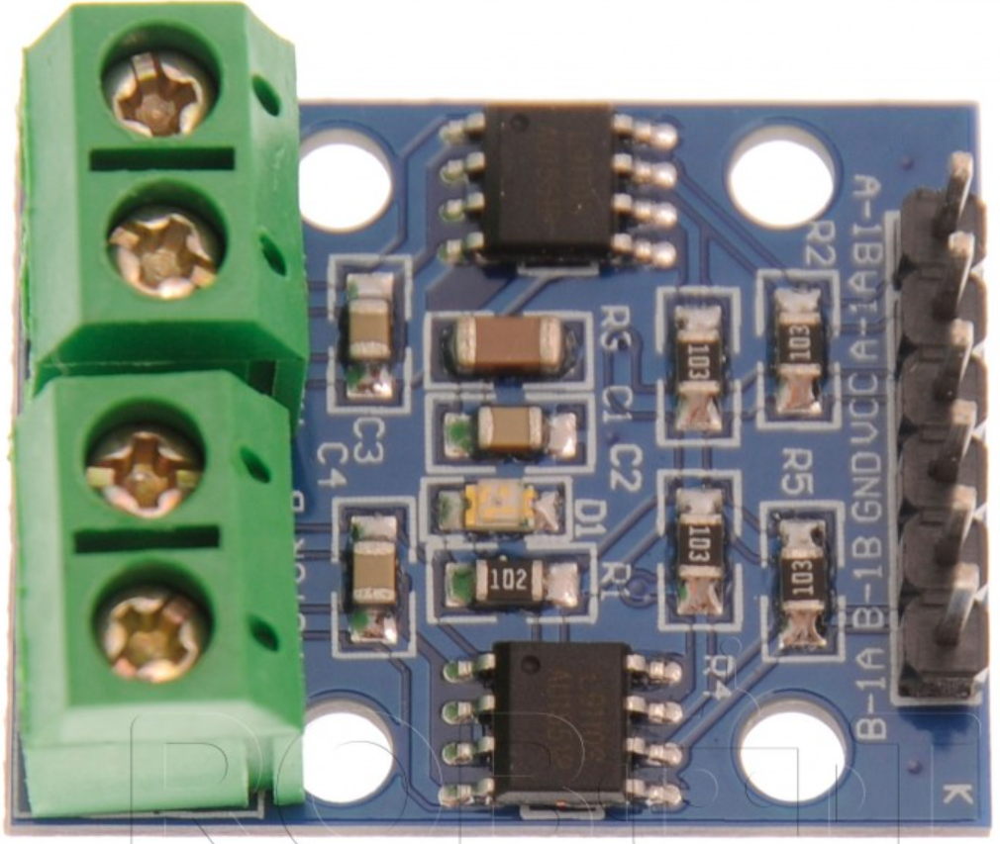
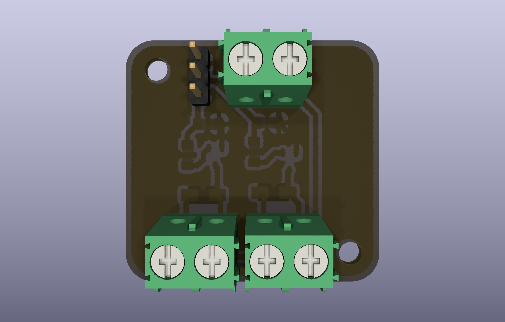
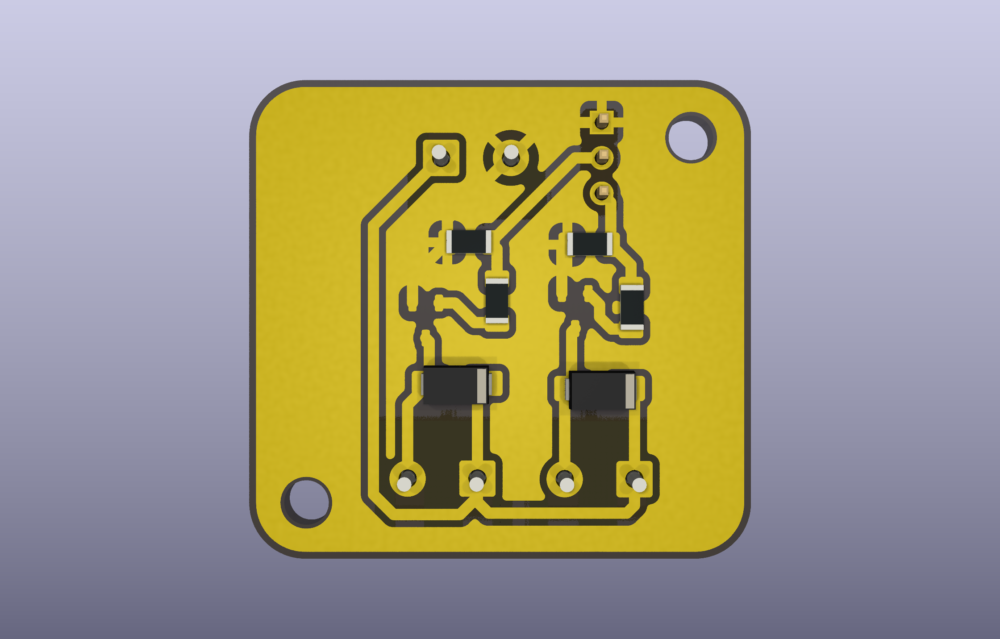
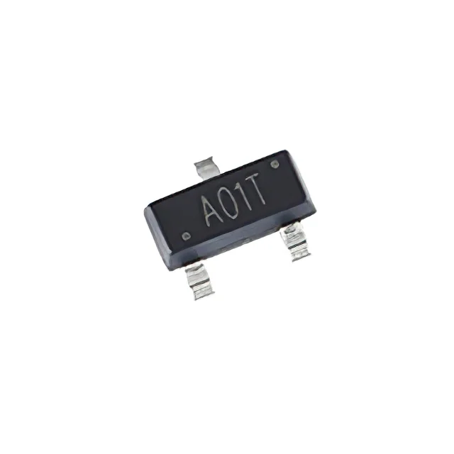
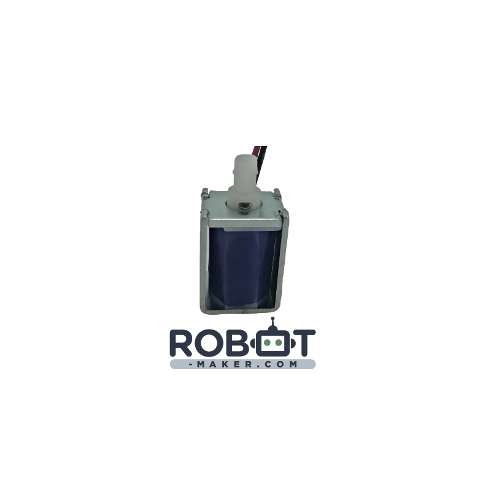
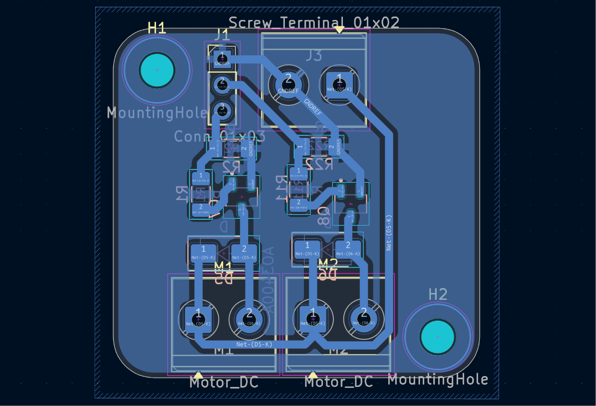

Au début du projet, la commande de la pompe à vide et de l’électrovanne devait être réalisée à l’aide d’un module L9110, couramment utilisé pour piloter de petites charges en courant continu. Cependant, après plusieurs essais, cette solution ne s’est pas révélée satisfaisante pour notre application. En effet, le L9110 présente une chute de tension interne qui réduit la tension réellement disponible aux bornes des actionneurs. La pompe à vide et l’électrovanne ne recevaient donc pas la totalité des 12 V nécessaires à leur fonctionnement optimal, ce qui limitait leurs performances et leur efficacité.

|  |  |  |
| :---: | :---: | :---: |
| **L9110** | **Customcard Recto** | **Customcard Verso** |

Face à cette contrainte, nous avons décidé de concevoir une carte de commande dédiée utilisant des MOSFET de puissance. Cette solution permet de commuter directement l’alimentation 12 V avec des pertes très faibles, garantissant ainsi que la pompe et l’électrovanne reçoivent la tension nécessaire à leur fonctionnement. La réalisation de cette carte personnalisée a donc permis d’obtenir une commande plus efficace, plus fiable et mieux adaptée aux exigences du système d’aspiration du Puzzle Bot.

# Les MOSFET de puissance

|  | 
| :---: |
| **MOSFET AO3400A** |

Les MOSFET constituent les composants principaux du circuit de commande de la pompe à vide et de l’électrovanne. Leur rôle est de servir d’interrupteurs électroniques capables de commuter une charge alimentée en 12 V à partir d’un signal de commande provenant de l’Arduino en 5 V. Cette solution permet de piloter des actionneurs consommant davantage de courant que ce que les sorties numériques de l’Arduino peuvent fournir directement.

Les MOSFET sont utilisés en mode saturation, c’est-à-dire qu’ils sont soit totalement bloqués, soit totalement passants. Lorsque la tension appliquée sur leur grille atteint environ 5 V grâce à une sortie numérique de l’Arduino, ils présentent une très faible résistance interne entre le drain et la source. Le courant peut alors circuler librement vers la pompe ou l’électrovanne, ce qui limite les pertes de puissance et l’échauffement des composants.

Cette méthode de commande présente plusieurs avantages. Elle assure une bonne efficacité énergétique, réduit les pertes thermiques et permet d’obtenir une commande rapide et fiable des actionneurs. Les MOSFET (AO3400A) constituent ainsi une solution particulièrement adaptée aux systèmes embarqués nécessitant la commande de charges en courant continu.

# Les résistances de commande

Des résistances sont intégrées dans le circuit afin d’assurer le bon fonctionnement des MOSFET. Une résistance est généralement placée entre la sortie de l’Arduino et la grille du transistor afin de limiter les courants transitoires lors des commutations et de protéger la sortie du microcontrôleur.

Une autre résistance, appelée résistance de rappel ou « pull-down », est souvent reliée entre la grille et la masse. Son rôle est de garantir que le MOSFET reste bloqué lorsque la sortie de l’Arduino est inactive ou lors du démarrage du système. Sans cette résistance, la grille pourrait rester flottante et provoquer l’activation involontaire de la pompe ou de l’électrovanne.

Ces composants passifs, bien que simples, sont indispensables pour assurer la stabilité et la fiabilité du circuit électronique. Ils permettent d’éviter les comportements imprévus et contribuent à la protection de l’ensemble du système.

# Les diodes de protection

La pompe à vide et l’électrovanne sont des charges inductives. Lorsqu’elles sont alimentées, elles stockent de l’énergie sous forme de champ magnétique. Lors de leur désactivation, cette énergie est brutalement libérée sous forme d’une surtension pouvant endommager les composants électroniques de commande.

Pour éviter ce phénomène, une diode de roue libre est placée en parallèle de chaque actionneur. Cette diode reste bloquée lorsque l’actionneur fonctionne normalement mais devient passante lors de la coupure de l’alimentation. Elle offre alors un chemin de circulation au courant induit et absorbe l’énergie stockée dans la bobine.

Grâce à cette protection, les MOSFET et l’Arduino sont préservés des pics de tension susceptibles de réduire leur durée de vie ou de provoquer leur destruction. L’utilisation de diodes de roue libre est donc une pratique indispensable dans la commande de charges inductives.

# La pompe à vide

La pompe à vide est l’élément responsable de la création de la dépression nécessaire au fonctionnement de la ventouse. Lorsqu’elle est alimentée, elle aspire l’air présent dans le circuit pneumatique, ce qui génère une pression inférieure à la pression atmosphérique à l’intérieur de la ventouse.

Cette différence de pression permet à la ventouse d’adhérer à la surface d’une pièce de puzzle. Une fois la pièce saisie, la pompe maintient la dépression afin de conserver une force d’aspiration suffisante pendant toute la durée du déplacement du robot.

Le choix d’une pompe électrique commandée électroniquement permet une intégration simple avec le système de contrôle du Puzzle Bot. Son fonctionnement automatisé contribue à la précision et à la répétabilité des opérations de manipulation des pièces.

# L’électrovanne

|  |
| :---: |
| **Électrovanne** |

L’électrovanne intervient lors de la phase de relâchement de la pièce. Il s’agit d’un dispositif électromécanique permettant de contrôler le passage de l’air dans le circuit pneumatique à l’aide d’une bobine commandée électriquement.

# Fonctionnement global du système

Le système fonctionne selon un principe simple basé sur l’alternance entre aspiration et relâchement. Lorsqu’une pièce doit être saisie, l’Arduino active le MOSFET associé à la pompe à vide. La pompe crée alors une dépression dans la ventouse qui adhère à la pièce de puzzle.

Pendant le déplacement de la pièce, la pompe reste activée afin de maintenir la dépression et garantir une tenue suffisante de la ventouse. Cette étape est essentielle pour éviter toute chute ou déplacement involontaire de la pièce durant son transport.

Lorsque l’électrovanne est activée par l’Arduino via son MOSFET de commande, elle ouvre un passage permettant à l’air extérieur de pénétrer dans le circuit. La pression à l’intérieur de la ventouse redevient alors égale à la pression atmosphérique. Une fois la pièce positionnée à l’endroit désiré.

Cette remise à la pression atmosphérique provoque la disparition de la force d’aspiration, ce qui libère instantanément la pièce de puzzle. L’électrovanne permet ainsi un relâchement rapide, précis et contrôlé des pièces à l’emplacement souhaité.

L’Arduino désactive la pompe puis active l’électrovanne. L’air extérieur entre dans le circuit pneumatique, annulant la dépression créée précédemment. La ventouse perd alors son adhérence et la pièce est déposée avec précision sur la zone d’assemblage.

# Conception assistée par ordinateur avec KiCad

|  | 
| :---: |

La conception électronique du circuit a été réalisée à l’aide du logiciel KiCad, un outil libre et professionnel dédié à la conception de cartes électroniques. La première étape a consisté à réaliser le schéma électrique en représentant l’ensemble des composants et leurs interconnexions.

Une fois le schéma validé, les empreintes physiques des composants ont été associées aux symboles électroniques. Cette étape permet de préparer la phase de conception du circuit imprimé en définissant les dimensions réelles de chaque composant qui sera soudé sur la carte.

La dernière phase a consisté à effectuer le routage du circuit imprimé, également appelé tracé du typon. Cette opération consiste à dessiner les pistes de cuivre reliant les différents composants tout en respectant les contraintes électriques et mécaniques. Le circuit imprimé obtenu est ensuite prêt pour la fabrication et l’intégration dans le système final.

# Intégration dans le Puzzle Bot

L’intégration du circuit de commande a été réalisée en tenant compte de l’architecture électronique du Puzzle Bot. Le robot utilise une CNC Shield montée sur un Arduino, ce qui permet de disposer facilement des différentes entrées et sorties nécessaires au contrôle des actionneurs.

Les signaux de commande des MOSFET ont été raccordés aux broches de la CNC Shield correspondant aux sorties numériques de l’Arduino. Cette solution simplifie le câblage et permet de conserver une architecture modulaire compatible avec le reste du système de contrôle du robot.

Grâce à cette intégration, le logiciel embarqué sur l’Arduino peut commander directement la pompe à vide et l’électrovanne en fonction des différentes étapes du processus d’assemblage. Le système d’aspiration devient ainsi entièrement synchronisé avec les mouvements du Puzzle Bot, assurant une manipulation automatique, précise et fiable des pièces du puzzle.