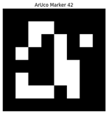
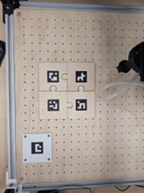

# Développement de la vision et analyse des pièces 

Après avoir défini l'architecture globale du projet, une phase importante a consisté à développer la partie vision artificielle, chargée d'analyser le plateau et d'identifier les différentes pièces du puzzle. 

L'objectif de cette étape est de permettre à la machine d'analyser la disposition des pièces du puzzle à partir d'images capturées par la caméra avant le lancement de la résolution. 

Cette phase a notamment permis de mettre en évidence plusieurs contraintes réelles liées à l'utilisation d'une caméra grand angle. 

 

## 1. Problème de distorsion de l'image 

Lors des premiers essais de capture, un phénomène de distorsion a été observé. La caméra utilisée possède un objectif grand angle permettant de visualiser une large zone de travail, mais ce type d'optique déforme l'image : les lignes qui sont physiquement droites peuvent apparaître légèrement courbées et les dimensions observées varient selon la position dans l'image. 

**Cette déformation peut entraîner :** 

* des erreurs de positionnement  
* des mesures incorrectes  
* des difficultés pour calculer précisément les coordonnées des pièces  
* une mauvaise estimation des distances sur le plateau. 

Il a été nécessaire d'intégrer une étape de correction géométrique afin de travailler sur une représentation plus fidèle de la réalité. 

 

## 2. Détection des contours des pièces 

L'un des points principaux du projet est d'identifier les pièces présentes sur le plateau. 

Les pièces du puzzle sont découpées à la découpeuse laser, ce qui produit des bords brûlés. Ces contours foncés créent un contraste naturel avec la surface claire des pièces et facilitent leur détection. 

 

### 2.1 Limites de la détection par contour uniquement 

Bien que la détection des contours permette de localiser les pièces, elle ne permet pas toujours de savoir précisément de quelle pièce il s'agit. Plusieurs pièces peuvent posséder une taille similaire et une forme proche. 

Pour résoudre ce problème, une méthode d'identification unique a été mise en place grâce aux marqueurs ArUco. 

 

## 3. Détection des marqueurs ArUco (OpenCV) 

Le projet utilise les fonctionnalités de détection ArUco intégrées à OpenCV. 

Les marqueurs ArUco sont des motifs visuels carrés contenant un identifiant unique. 

**Chaque marqueur possède :** 

* un identifiant unique  
* une orientation détectable  
* une position mesurable dans l'image. 

La détection est réalisée automatiquement par OpenCV à partir des photographies prises par la caméra. 

 

### 3.1 Marqueurs ArUco sur chaque pièce 

Chaque pièce du puzzle possède son propre marqueur ArUco. Cette approche permet au système d'identifier immédiatement chaque élément sans ambiguïté. 

Lors de l'analyse de l'image, le programme est capable de connaître directement : 

* quelle pièce est observée  
* où elle se trouve  
* dans quel sens elle est orientée. 

Cette méthode est beaucoup plus robuste qu'une simple reconnaissance de forme. 

 

 

### 3.2 Marqueurs de référence  

En plus des marqueurs présents sur les pièces, plusieurs marqueurs ArUco de référence sont placés directement sur le plateau. Leur rôle est de fournir un repère fixe à la machine. 

**Ces marqueurs permettent :** 

* de définir le système de coordonnées  
* de connaître l'orientation du plateau  
* de convertir les coordonnées de l'image en coordonnées réelles. 

## 4. Mémorisation des positions des pièces  

Une fois tous les marqueurs détectés, le programme construit une représentation complète du puzzle. 

Pour chaque pièce, les informations suivantes sont enregistrées : 

**Pièce 5 :** 
* Position : X = 145 mm  
* Position : Y = 210 mm 
* Rotation : 45° 

Ces données sont extraites : 

* une première fois sur l'image du puzzle résolu  
* une seconde fois sur l'image du puzzle mélangé (à résoudre). 

La comparaison des deux images permet ensuite de déterminer où doivent être placées chaque pièce. 

À l'issue de cette étape, le système est capable d'analyser la configuration du puzzle à et de fournir toutes les informations nécessaires à l'algorithme de résolution. 

 