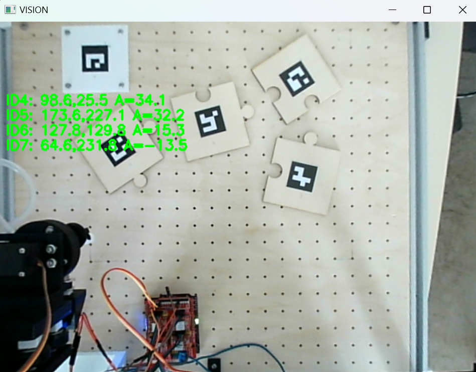

# Précision 

Au cours du développement du Puzzle Bot, plusieurs réflexions ont été menées afin d'améliorer la précision globale du système. Deux sujets principaux ont été étudiés : la nécessité d'effectuer un retour systématique à l'origine après chaque action, ainsi que la fiabilité des mesures réalisées par la caméra. 

Cette phase a permis d'identifier certaines optimisations intéressantes et de faire des choix visant à simplifier le fonctionnement tout en conservant une précision suffisante pour mener à bien la réalisation du puzzle. 

 

## 1. Réflexion sur le retour à l'origine 

Il est courant de revenir régulièrement à une position de référence afin de recalibrer le système et limiter l'accumulation des erreurs. 

Le principe était simple : 

Prendre une pièce 
↓ 
Déposer la pièce 
↓ 
Retour à l'origine 
↓ 
Aller chercher la pièce suivante 

L'idée semblait intéressante car elle permettait de repartir d'un point connu avant chaque nouvelle opération. 

 

### 1.1 Coordonnées absolues 

Après analyse, il est apparu que le projet travaille principalement en coordonnées absolues. 

**Chaque pièce possède :** 

* une position actuelle  
* une position cible  
* des coordonnées calculées directement à partir des données issues de la caméra. 

Par exemple : 

Pièce 4 : 
Position actuelle : X=120 Y=80 
 
Position cible : 
X=250 Y=160 

Le robot n'a donc pas besoin de connaître son dernier déplacement, il sait directement où il doit aller. 

 

### 1.2 Suppression du retour systématique à l'origine 

Ce constat a conduit à s’interroger sur l’intérêt d’un retour systématique à l’origine. 

**Plusieurs inconvénients ont été identifiés :**

* augmentation du temps de résolution  
* multiplication des déplacements inutiles  
* usure mécanique supplémentaire  
* risque d'introduire de nouvelles erreurs de positionnement. 

Le choix final a donc été de supprimer cette étape. Le robot se déplace directement d'une action à l'autre en utilisant les coordonnées absolues calculées lors de l'analyse du puzzle. 

## 2. Augmenter la résolution de l'image 

Une idée pour améliorer la précision consistait à augmenter le nombre de pixels exploités par la caméra. 

L'objectif était simple : plus une image contient de pixels, plus la position d'un marqueur ou d'une pièce peut être mesurée finement. Cette solution s'est révélée fonctionnelle lors des essais. 

Cependant, elle présentait également certains inconvénients : 

* augmentation du temps de traitement 
* consommation mémoire plus importante. 

Même si cette approche pouvait améliorer légèrement les résultats, elle n'a finalement pas été retenue. 

 

## 3. Stabilisation des mesures 

Lors d'une seule capture, plusieurs phénomènes peuvent perturber les résultats : 

* bruit du capteur  
* variations lumineuses  
* légers mouvements de la caméra  
* erreurs de détection ponctuelles. 

Pour réduire ces effets, le programme ne s'appuie pas sur une image unique, il réalise plusieurs captures consécutives. 

 

### 3.1 Moyenne sur plusieurs images 

Le principe consiste à capturer cinquante images successives. 

Pour chaque image, les coordonnées détectées sont enregistrées. 

Exemple : 

Frame 1 : X = 152.3 
Frame 2 : X = 151.8 
Frame 3 : X = 152.1 
... 
Frame 50 : X = 152.0 
 

Une moyenne est ensuite calculée : 

Position finale retenue : 
 
X = 152.04 
 

Le même principe est appliqué aux coordonnées X, Y et aux angles de rotation. 

 

Grâce à ces optimisations, le système obtient des coordonnées plus stables et plus fiables tout en réduisant les déplacements inutiles de la machine. Cela améliore à la fois la précision du positionnement et l'efficacité globale de la résolution du puzzle. 

 