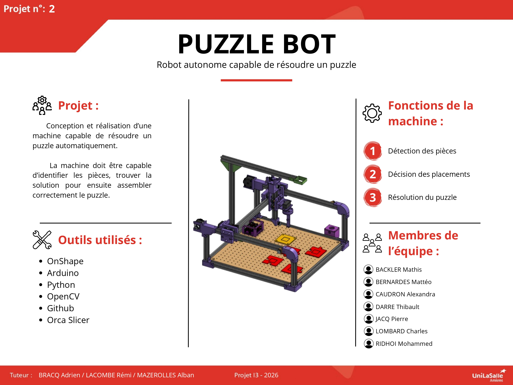

# Bienvenue sur la documentation du groupe 02 !

Bienvenue dans la documentation du projet puzzlebot. Ce site a pour but de fournir toutes les informations nécessaires pour comprendre, utiliser et reproduire efficacement notre projet.

[Notre projet sur Onshape](https://cad.onshape.com/documents/3a3b2489e53195ec15c856c9/v/fcd319f8f9de18a88cd7e1be/e/673e636d781b8f8fb3797142?renderMode=0&uiState=6a1ff203d168c527f46a8faf){: .btn .btn-primary .fs-5 .mb-4 .mb-md-0 .mr-2 }
[Notre repo GitHub](https://github.com/Makerspace-Amiens-2025-26/Puzzle-Bot-Groupe02/){: .btn .fs-5 .mb-4 .mb-md-0 }

<iframe height="600" width="100%" src="https://modelembedder.net/embed?did=3a3b2489e53195ec15c856c9&wvm=v&wvmid=fcd319f8f9de18a88cd7e1be&eid=673e636d781b8f8fb3797142&elementType=ASSEMBLY" frameborder="0"></iframe>

## À propos du Projet

Afin de concevoir une machine de A à Z qui se doit d'être capable de résoudre un puzzle en autonomie. Nous disposions de 75 heures de prévu dans nos emplois du temps.

## Poster

Voici le poster de notre projet !

