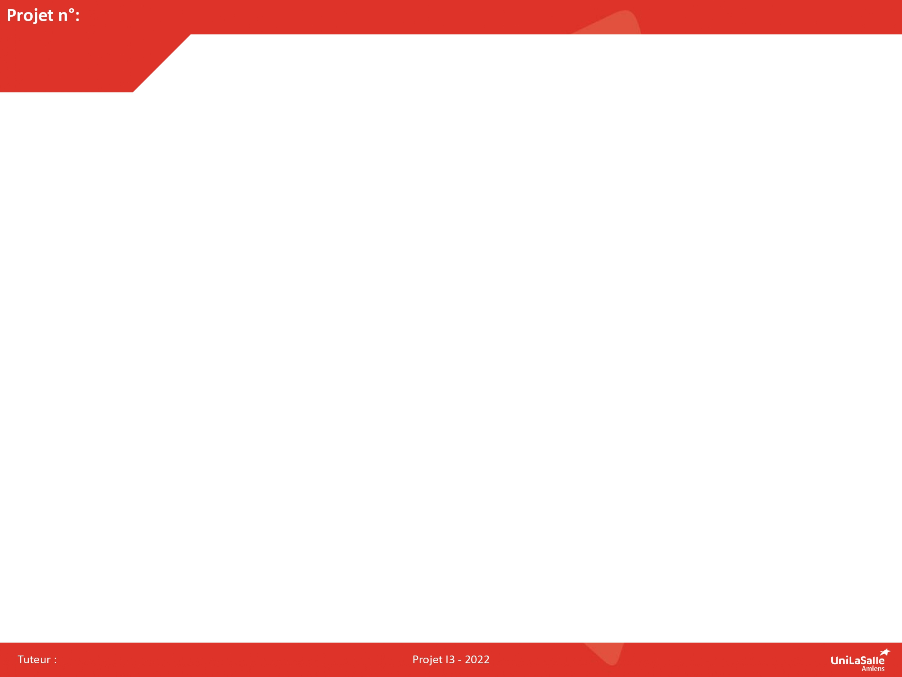

# Bienvenue sur la documentation du groupe 02 !

Bienvenue dans la documentation du projet puzzlebot. Ce site a pour but de fournir toutes les informations nécessaires pour comprendre, utiliser et reproduire efficacement notre projet.

[Notre projet sur Onshape](https://cad.onshape.com/documents/3a3b2489e53195ec15c856c9/w/f4d417cd84ea9be723ef1db8/e/673e636d781b8f8fb3797142){: .btn .btn-primary .fs-5 .mb-4 .mb-md-0 .mr-2 }
[Notre repo GitHub](https://github.com/Makerspace-Amiens-2025-26/Puzzle-Bot-Groupe02/){: .btn .fs-5 .mb-4 .mb-md-0 }

<iframe height="600" width="100%" src="https://modelembedder.net/embed?did=3a3b2489e53195ec15c856c9&wvm=v&wvmid=75df847c1ed7131f5c659d33&eid=673e636d781b8f8fb3797142&elementType=ASSEMBLY" frameborder="0"></iframe>

## À propos du Projet

Nous avions pour but de concevoir de A à Z une machine qui se doit d'être capable de résoudre un puzzle en autonomie. Pour réaliser ce projet, nous avions 75 heures.

## Poster

Voici le poster de notre projet !

## Vidéo

Ici vous publierez la vidéo de votre projet. 
- 1min30 au format vertical
- Présentation du projet 
- Des explication du fonctionnement du projet
- Des vues du projet / Prototype / Application etc... 
- Des plans du fonctionnement (même basique ou des éléments séparés)
- Une conclusion
- Si en stockage local : <50mo

<video src="images/intro_amiens.mp4" controls title="Title"  style="width: 100%;"></video>

---
